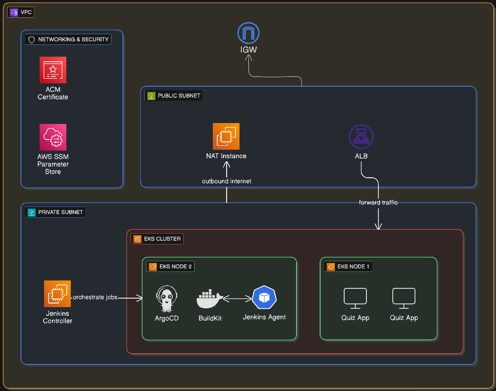

# Quiz-app Infrastructure As Code

This repository contains the Terraform and supporting docs that stand up the Quiz App foundation on AWS (VPC, security groups, Route53, EKS control plane and node groups, and a Jenkins host). Everything here is infrastructure-only; application configuration lives in the GitOps repo.

## What this repo is responsible for
- Creating the network, IAM, security groups, DNS zones, EKS cluster, managed node groups, and Jenkins EC2 instance for the Quiz App.
- Providing outputs that downstream GitOps and application repos consume.
- Documenting operational scripts used to deploy and monitor the stack (see `scripts/README.md`).

## Related repositories
- **[Frontend](https://github.com/liav-hasson/quiz-app-frontend.git)** – React UI served by Nginx.
- **[Backend](https://github.com/liav-hasson/quiz-app-backend.git)** – Flask API and business logic.
- **[GitOps](https://github.com/liav-hasson/quiz-app-gitops.git)** – ArgoCD app-of-apps for cluster configuration.
- **[IaC](https://github.com/liav-hasson/quiz-app-iac.git)** – You are here; provisions AWS infrastructure with Terraform.
- **[Mini version](https://github.com/liav-hasson/quiz-app-mini.git)** – Local or lightweight AWS deployment.

## Repository layout
- `terraform/` – Root Terraform configuration.
  - `main.tf`, `providers.tf`, `variables.tf`, `outputs.tf`, `terraform.tfvars` – entry point and variables for the stack.
  - `modules/` – reusable modules (`vpc`, `security-groups`, `route53`, `iam`, `ec2`).
  - `prod_cluster/` – production cluster pieces (`eks-cluster`, `node-groups`, `addons`, `security-groups`).
- `ci/Jenkinsfile` – Jenkins pipeline for planning/applying infrastructure.
- `configs/project-dependencies.txt` – supporting tool and package dependencies.
- `scripts/README.md` – documentation for deployment and monitoring helper scripts (aliases, usage, and logging).
- `diagram.png` – high-level architecture diagram.

## Usage
1. Work from `terraform/` (Terraform >= 1.x, AWS credentials configured).
2. Update variables in `terraform/terraform.tfvars` as needed.
3. Run `terraform init`, `terraform plan`, and `terraform apply` to provision the stack.

## Architecture diagram

